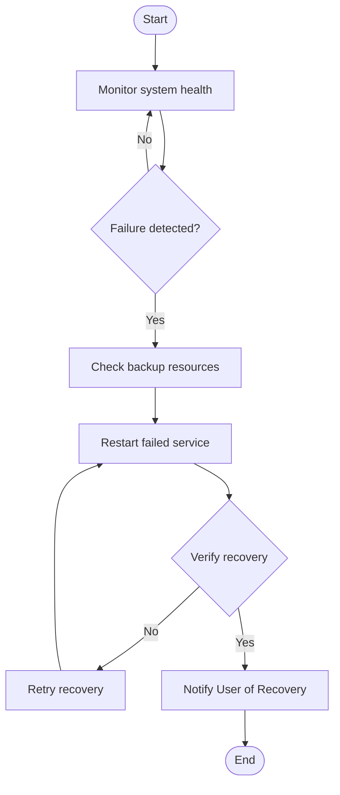

# AI-Driven Multi-Agent Self-Healing Cloud Infrastructure

## 📋 Table of Contents

- [Project Overview](#project-overview)
- [Architecture](#architecture)
- [Technology Stack](#technology-stack)
- [Key Features](#key-features)
- [Agent Modes](#agent-modes)
- [CI/CD Pipeline](#cicd-pipeline)
- [Model-Centric Programming (MCP)](#model-centric-programming-mcp)
- [Development Phases](#development-phases)
- [Testing Strategy](#testing-strategy)
- [Project Structure](#project-structure)

---

## 🎯 Project Overview

**Project Name**: AI-Driven Multi-Agent Self-Healing Cloud Infrastructure

**Objective**: Build a cloud infrastructure where multiple **AI agents** autonomously handle cloud management tasks such as **self-healing**, **scaling**, **task solving**, and **security monitoring**. The system aims to enhance cloud resource management while ensuring high performance, fault tolerance, and security.

### Key Components

1. **Self-Healing Agent**: Automatically detects and recovers from system failures
2. **Task-Solving Agent**: Handles user requests and operational tasks (e.g., file uploads)
3. **Scaling Agent**: Dynamically adjusts cloud resources based on demand
4. **Coding Agent**: Automates code generation, debugging, and testing
5. **Security Agent**: Monitors for threats and ensures system security
6. **Performance Monitoring Agent**: Tracks and optimizes system performance
7. **Optimization Agent**: Manages resources for cost-efficiency and optimal performance
8. **User Interaction Agent**: Handles user requests and provides real-time feedback

---

## 🏗️ Architecture

### System Architecture Diagram

```
┌─────────────────────────┐       ┌──────────────────────┐       ┌────────────────────┐
│  User Interaction Agent  │ <---> │  Task-Solving Agent  │ <---> │   Coding Agent     │
└─────────────────────────┘       └──────────────────────┘       └────────────────────┘
            │                              │                               │
            v                              v                               v
┌──────────────────────┐       ┌─────────────────────┐        ┌──────────────────────┐
│  Self-Healing Agent  │ <--> │   Scaling Agent     │ <-----> │   Security Agent     │
└──────────────────────┘       └─────────────────────┘        └──────────────────────┘
            │                              │                               │
            v                              v                               v
    ┌────────────────────┐   ┌──────────────────────┐    ┌───────────────────────┐
    │ Performance Monitor│   │ Optimization Agent   │    │  Database (PostgreSQL)│
    │      Agent         │   │                      │    │  (MongoDB, Redis)     │
    └────────────────────┘   └──────────────────────┘    └───────────────────────┘
```

**Explanation:**
- **User Interaction Agent**: Handles user requests and interactions
- **Task-Solving Agent**: Solves tasks assigned by the user or other agents
- **Self-Healing Agent**: Detects failures and recovers cloud resources
- **Scaling Agent**: Scales resources up or down based on load
- **Security Agent**: Monitors security and compliance
- **Performance Monitoring Agent**: Tracks system performance and health
- **Optimization Agent**: Ensures efficient use of resources
- **Database**: Stores logs, agent activity data, user interactions

### Agent Communication Flow (Sequence Diagram)

```
User → User Interaction Agent: Submit scaling request
User Interaction Agent → Task-Solving Agent: Forward request for scaling
Task-Solving Agent → Scaling Agent: Delegate request to scale resources
Scaling Agent → Cloud Resources (EC2, Lambda): Scale up resources
Scaling Agent → Task-Solving Agent: Confirm scaling completed
Task-Solving Agent → User Interaction Agent: Notify user of scaling success
User Interaction Agent → User: Display scaling confirmation
```

### Self-Healing Process Flow (Activity Diagram)



### Cloud Interaction Architecture

```
┌──────────────────┐           ┌───────────────────────┐           ┌───────────────────────┐
│  User Interface  │<--------->│ User Interaction Agent│<--------->│  Task-Solving Agent   │
│ (React, Node.js) │           │ (Node.js, Python)     │           │ (Python, TensorFlow)  │
└──────────────────┘           └───────────────────────┘           └───────────────────────┘
                                        │                              │
                                        v                              v
                            ┌───────────────────────┐        ┌───────────────────┐
                            │    Scaling Agent      │<------>│  Cloud Resources  │
                            │  (Python, gRPC)       │        │ (EC2, Lambda, S3) │
                            └───────────────────────┘        └───────────────────┘
                                        │
                                        v
                            ┌───────────────────────┐
                            │  Self-Healing Agent   │
                            │ (Python, TensorFlow)  │
                            └───────────────────────┘
```

### CI/CD Pipeline Architecture

```
┌──────────────────┐          ┌──────────────────────┐          ┌──────────────────────┐
│ GitHub/GitLab    │          │ Jenkins/GitLab CI    │          │ Docker Hub/Registry  │
│ (Code Repository)│<-------->│ (CI/CD Build)        │<-------->│ (Docker Images)      │
└──────────────────┘          └──────────────────────┘          └──────────────────────┘
         │                              │                                  │
         v                              v                                  v
┌──────────────────┐          ┌──────────────────────┐      ┌───────────────────────┐
│ Unit Tests       │          │ Docker Build & Test  │<---->│ Kubernetes/Minikube  │
│ Integration Tests│<-------->│ Deploy to Staging    │      │ (Local Deployment)    │
└──────────────────┘          └──────────────────────┘      └───────────────────────┘
                                        │
                                        v
                              ┌──────────────────────┐
                              │  Cloud Deployment    │
                              │ (AWS, GCP, Azure)    │
                              └──────────────────────┘
```

---

## 💻 Technology Stack

### Cloud Provider

**Recommended: AWS** (Amazon Web Services)
- **Services**: EC2 (Compute), S3 (Storage), Lambda (Serverless), RDS (Databases), CloudWatch (Monitoring), IAM (Security)
- **Why AWS**: Provides a wide range of services for cloud-based applications, with excellent scalability, security, and performance. It also supports **AI/ML services** like **AWS SageMaker**

**Alternatives**: Google Cloud Platform (GCP), Microsoft Azure

### Programming Languages

| Language | Purpose | Use Case |
|----------|---------|----------|
| **Python** | AI/ML, agents | Developing AI-driven agents, data processing, machine learning |
| **Node.js** | Backend services | Real-time communication, creating APIs for agent interaction |
| **JavaScript** | Frontend | Building user interaction agent and agent management dashboards |
| **Go** | Microservices | Building highly concurrent and scalable systems for agent communication |

### AI/ML Frameworks

- **TensorFlow**: Comprehensive ecosystem for developing machine learning models, reinforcement learning
- **PyTorch**: Flexible deep learning framework, known for dynamic computation graphs
- **OpenAI Gym**: Creating environments to train reinforcement learning agents
- **Scikit-learn**: Simple machine learning tasks such as regression, classification, and clustering

### Orchestration & Containerization

- **Docker**: Containerization of each agent, ensuring portability and isolation
- **Kubernetes**: Orchestrates and manages containers at scale
- **Docker Compose**: Defining and running multi-container Docker applications locally
- **AWS EKS / GKE / AKS**: Managed Kubernetes clusters for cloud deployment

### Communication & APIs

- **gRPC**: High-performance communication between services with bi-directional streaming
- **REST APIs** (Flask/FastAPI): Simple HTTP-based interfaces for agent interaction
- **RabbitMQ / Kafka**: Message brokers for asynchronous communication between agents

### Database & Storage

- **PostgreSQL / MySQL**: Relational databases for storing agent interactions, logs, and user data
- **MongoDB**: NoSQL database for unstructured data like logs and event data
- **MinIO**: S3-compatible storage service for local cloud storage simulation

### Monitoring & Logging

- **Prometheus + Grafana**: Monitoring and visualizing performance metrics in real-time
- **AWS CloudWatch / Google Stackdriver / Azure Monitor**: Centralized logging and monitoring in cloud environments
- **ELK Stack** (ElasticSearch, Logstash, Kibana): Centralized logging and real-time log analysis

### Complete Tech Stack Summary

| Category | Technology |
|----------|-----------|
| **Cloud Provider** | **AWS** (preferred) / **GCP** / **Azure** |
| **Programming Languages** | **Python** (AI/ML, agents) / **Node.js** (backend) / **JavaScript** (UI) / **Go** (backend) |
| **AI/ML Frameworks** | **TensorFlow** / **PyTorch** / **OpenAI Gym** / **Scikit-learn** |
| **Orchestration & Containers** | **Docker** / **Kubernetes** / **Minikube** / **Docker Compose** |
| **Communication & APIs** | **gRPC** / **REST APIs** / **RabbitMQ** / **Kafka** |
| **Database & Storage** | **PostgreSQL** / **MongoDB** / **MinIO** |
| **Monitoring & Logging** | **Prometheus + Grafana** / **CloudWatch/Stackdriver/Monitor** / **ELK Stack** |

---

## ✨ Key Features

### 1. Multi-Agent Collaboration and Orchestration

- **Agent Coordination**: Multiple agents collaborate and communicate seamlessly, ensuring tasks are routed correctly and failures are detected and mitigated
- **Message Queue**: Uses message brokers (RabbitMQ, Kafka) for asynchronous communication between agents
- **Task Delegation and Prioritization**: Agents handle specific tasks and prioritize based on importance
- **Agent Learning**: Incorporates machine learning, specifically **Reinforcement Learning (RL)**, so agents continuously learn and adapt

### 2. Self-Healing and Autonomous Issue Resolution

- **Failure Detection and Recovery**: Continuously monitors for failures and automatically initiates recovery processes
- **Proactive Maintenance**: Predicts potential failures and performs maintenance before failures occur
- **Auto-Scaling**: Automatically adjusts cloud resources based on demand
- **Dynamic Resource Allocation**: Allocates resources dynamically and efficiently
- **Service Monitoring and Auto-Recovery**: Attempts auto-recovery measures when services fail or underperform

### 3. User Interaction and Experience

- **Natural Language Processing (NLP) Interface**: Voice or text-based support for interacting with agents
- **User Task Management**: Users can assign tasks to specific agents or let the system handle everything autonomously
- **Real-Time Feedback**: Users receive real-time updates and explanations about agent actions
- **Transparency and Explainability**: Provides understandable explanations for decisions made by agents
- **User Dashboards**: Centralized dashboard with visual representation of agent status, task progress, and system health

### 4. Intelligent Code Generation and Debugging (Coding Agent)

- **Automated Code Generation**: Generates code snippets based on user requirements
- **Code Error Detection and Fixing**: Detects and fixes errors automatically or suggests fixes
- **Unit Test Generation**: Automatically generates unit tests to ensure deployed code works as expected
- **Code Suggestions**: Suggests improvements to code (refactoring, security patches)

### 5. Security and Compliance

- **Continuous Threat Detection**: Continuously monitors for security threats, unauthorized access, and vulnerabilities
- **Intrusion Prevention**: Real-time intrusion detection with automatic security actions
- **Access Control and Authentication**: Role-Based Access Control (RBAC) using IAM tools
- **Data Encryption and Privacy**: Data encrypted both in transit and at rest using cloud-native encryption tools
- **Compliance Monitoring**: Automatically checks for compliance with industry standards (GDPR, HIPAA)

### 6. Monitoring, Logging, and Performance Optimization

- **Real-Time Monitoring**: Tracks key performance metrics and alerts when thresholds are exceeded
- **Analytics and Dashboards**: Tracks agent performance, task resolution time, and success/failure rates
- **Event-Driven Architecture**: Uses Kafka or AWS EventBridge for event-driven architecture
- **Logging**: All agent actions and system states are logged for transparency and troubleshooting
- **Performance Tuning and Resource Optimization**: Continuously optimizes cloud resource usage
- **Cost Optimization**: Detects inefficiencies and reduces costs by scaling down unused resources

### 7. AI and Machine Learning Integration

- **Reinforcement Learning (RL)**: Self-Healing and Scaling Agents trained using RL to learn from past failures
- **Predictive Modeling**: Uses predictive models to foresee demand spikes and resource shortages
- **Graph Neural Networks (GNNs)**: Performance Monitoring Agent uses GNNs to analyze relationships between cloud resources
- **Natural Language Processing (NLP)**: User Interaction Agent uses NLP models to process user queries

### 8. User Feedback and Continuous Improvement

- **Feedback Loop**: Prompts users for feedback after each task or issue resolution
- **Continuous Learning**: Agents continuously improve based on user feedback and real-time performance data
- **Agent Performance Review**: Provides users with options to rate agent performance and view analytics

### 9. Integration with Other Services

- **Cloud Service Integration**: Interacts with cloud services such as AWS S3, Azure Blob Storage, Google Cloud Functions, and Lambda
- **Third-Party APIs**: Integrates third-party APIs for machine learning models, IoT management, or security monitoring
- **Event-Driven Workflow Integration**: Integrates with cloud-native event-driven workflows

---

## 🤖 Agent Modes

The system supports two operational modes for agents: **Auto Mode** and **Manual Mode**.

### Auto Mode (Agent Resolves Automatically)

**Flow:**
1. **Error Occurrence**: An error is detected (e.g., service crash, resource failure)
2. **Auto Resolution**: The agent automatically performs the required action to resolve the issue
3. **Notification to User**: Once resolved, the agent sends a detailed notification with:
   - The error that occurred
   - How the agent resolved the issue
   - The reason behind the resolution

**Example Workflow:**
```
Error Detected: EC2 instance crash
Action Taken: Agent automatically restarts the instance and scales resources
Notification: "Error Detected: EC2 instance crash. The system automatically 
restarted the instance and scaled resources to ensure continuous availability."
Explanation: "We detected an issue with resource availability on the EC2 instance. 
We restarted the instance and scaled up the resources to ensure uninterrupted service."
```

**UI/Interaction Design:**
- Agent handles everything in the background
- Provides informative message once the issue is resolved
- Example: "The error has been resolved automatically. Here's a brief explanation 
  of the issue and how we fixed it."

### Manual Mode (User Decision Required)

**Flow:**
1. **Error Occurrence**: An error is detected, and the system stops to notify the user
2. **Manual Notification**: System sends error details with an option to accept or decline the proposed action
3. **Wait for User Input**: System waits for user to acknowledge and either approve or decline
4. **Action Taken**: Once user confirms, the agent proceeds with the necessary action
5. **Explanation**: After completion, the agent provides a complete explanation

**Example Workflow:**
```
Error Detected: Resource usage exceeded the set threshold
Action Pending: System sends error to user
Message: "Error Detected: Resource usage exceeded the set threshold. 
Would you like to proceed with scaling up the resources?"
User Input: User can accept auto-scaling or deny/modify the action
Resolution: If approved, agent scales resources; if manual intervention requested, 
agent shows detailed step-by-step process
Final Report: "Issue Detected: Resource usage exceeded. Resolution Process: 
The system scaled up resources to meet demand. Reason for the Decision: Scaling 
was needed to prevent service degradation during high traffic."
```

**UI/Interaction Design:**
- System presents the error and asks for a decision
- Example prompt: "Error Detected: Resource usage exceeded. Would you like to 
  scale resources automatically? (Press Enter to accept, or type 'Manual' for custom action)."
- After user input, system executes action and displays step-by-step explanation

---

## 🔄 CI/CD Pipeline

### Overview

A CI/CD pipeline automates the process of integrating code changes, testing those changes, and deploying them to production. For this multi-agent cloud infrastructure, the pipeline handles:

- **Continuous Integration (CI)**: Automatically integrates new code changes, runs tests, and generates build artifacts
- **Continuous Deployment (CD)**: Automatically deploys code changes to production after tests pass

### Key Stages

#### 1. Code Commit and Version Control

- **Version Control System**: Git for managing source code
- **Branching Strategy**: GitFlow or Feature Branching for managing development, feature testing, and production-ready code

#### 2. Continuous Integration (CI)

- **Build Automation**: Every commit triggers automatic build
- **Unit Testing and Linting**: Uses PyTest (Python), Jest (JavaScript), JUnit (Java)
- **Integration Testing**: Tests interaction between components and agents

#### 3. Continuous Deployment (CD)

- **Deployment Automation**: Code automatically deployed to staging environment after tests pass
- **Infrastructure as Code**: Terraform or AWS CloudFormation for defining infrastructure
- **Container Orchestration**: Kubernetes for managing deployment of containers
- **Deployment Strategies**: Blue-Green Deployment or Canary Releases for gradual rollouts

#### 4. Continuous Monitoring and Feedback

- **Monitoring and Alerts**: Prometheus and Grafana for tracking system performance
- **Logging and Audit Trails**: ELK Stack or AWS CloudWatch Logs for centralized logging
- **Automated Rollbacks**: Automatic rollback on failed deployments

### Tools for CI/CD Pipeline

| Category | Tools |
|----------|-------|
| **Version Control** | Git, GitHub/GitLab/Bitbucket |
| **CI/CD Server** | Jenkins, GitLab CI, CircleCI, Travis CI |
| **Containerization** | Docker, Docker Compose |
| **Orchestration** | Kubernetes, Minikube |
| **Infrastructure as Code** | Terraform, AWS CloudFormation |
| **Monitoring** | Prometheus + Grafana, ELK Stack, CloudWatch |

### CI/CD Pipeline Workflow

1. **Code Commit**: Developer commits code to Git repository
2. **Continuous Integration**:
   - CI tool (Jenkins, GitLab CI) is triggered
   - Code is built using Dockerfile to create container image
   - Unit tests and integration tests are run
   - If tests pass, code is packaged as artifact (Docker image)
3. **Continuous Deployment**:
   - Docker image is pushed to container registry (Docker Hub, Amazon ECR)
   - Terraform or CloudFormation provisions cloud infrastructure
   - Kubernetes deployment is updated with new version
   - New image is deployed to production environment
4. **Monitoring and Feedback**:
   - System is monitored using Prometheus + Grafana
   - Alerts are triggered if there are performance issues
5. **Automated Rollback**:
   - If failure is detected, system automatically rolls back to previous working version

### CI/CD Pipeline for Multi-Agent System

1. **Commit Code**: Every time code for an agent is committed, pipeline triggers
2. **Build Docker Image**: Create Docker images for each agent
3. **Test**: Run unit tests and integration tests on individual agents and their interactions
4. **Push to Container Registry**: Push built Docker images to container registry
5. **Deploy to Staging**: Deploy agents to staging Kubernetes cluster
6. **Manual/Automated Approval**: Approve changes for deployment to production
7. **Deploy to Production**: Deploy new agent version to production using Kubernetes
8. **Monitoring**: Monitor agent performance using Prometheus and Grafana dashboards

---

## 🧠 Model-Centric Programming (MCP)

### What is Model-Centric Programming?

**Model-Centric Programming** refers to a paradigm where machine learning models are central to the system's logic and decision-making. Instead of writing traditional code for solving problems, developers focus on building, training, evaluating, and deploying models that make decisions for the system.

### Relevance to This Project

Given that this system involves building **AI agents** for autonomous cloud management, **self-healing** capabilities, **scaling**, and other tasks driven by machine learning and AI decision-making, adopting **Model-Centric Programming** brings several advantages:

#### Benefits of MCP

1. **Real-Time Adaptation and Learning**: Agents continuously learn and adapt to changes in cloud resources, workload, and user demand
2. **Integration with Reinforcement Learning**: Makes it easier to manage and deploy models that control agent behaviors
3. **Centralized Model Management**: Centralizes focus on models, making it easier to manage training, deployment, and monitoring
4. **Predictive Analytics and Automation**: Makes it easier to build predictive models that anticipate issues before they occur
5. **Dynamic Behavior of Agents**: Focus on improving model accuracy and performance of agent decision-making capabilities

### How MCP Fits into Tech Stack

- **Machine Learning Models**: Use TensorFlow or PyTorch to train and deploy models
- **Reinforcement Learning**: Use RL models for Self-Healing Agent to adapt based on failure patterns
- **Model Deployment**: Use TensorFlow Serving, MLflow, or Seldon for automating deployment of new model versions
- **Data Pipelines**: Implement data pipelines using Apache Kafka or Google Cloud Pub/Sub for streaming data to models

### Key Features for MCP Integration

1. **Model Training and Evaluation**: Automate model training for RL, anomaly detection, or predictive models
2. **Model Versioning**: Use MLflow or DVC to manage model versions
3. **Automated Model Deployment**: Integrate CI/CD pipeline with model deployment using TensorFlow Serving, KubeFlow, or AWS SageMaker
4. **Monitoring and Feedback Loop**: Track agent behavior and model performance using Prometheus or Grafana
5. **Model Retraining**: Periodically retrain models based on new data or changing cloud conditions

### Should You Use MCP?

**Yes, if:**
- AI models are core to agent decisions
- Continuous learning is required
- You're using Reinforcement Learning
- You want model transparency and monitoring

**No, if:**
- Simple logic is sufficient (if-else statements)
- Model management is too complex for your needs

**Conclusion**: Given the nature of this project—building AI-driven agents for cloud management—**Model-Centric Programming (MCP) is highly recommended**.

---

## 📅 Development Phases

### Phase 1: Agent Development

- **Task-Solving Agent**: Handle file uploads, user requests, and delegate tasks to other agents
- **Self-Healing Agent**: Monitor system health, identify failures, implement auto-recovery measures
- **Scaling Agent**: Implement logic to scale resources (adding/removing containers, adjusting VM capacity)
- **Security Agent**: Detect security threats and respond accordingly
- **Coding Agent**: Implement automatic code generation, error detection, and debugging

### Phase 2: Agent Testing

- **Unit Tests**: Write tests for individual agents using PyTest (Python) or Jest (Node.js)
- **Integration Tests**: Test how agents interact with each other and with simulated cloud services
- **Functional Testing**: Ensure each agent performs its assigned task correctly
- **End-to-End Tests**: Simulate user requests and ensure agents work together to process and resolve them

### Phase 3: CI/CD Setup

- **Version Control**: Set up Git repositories to manage agent code and cloud configuration files
- **CI/CD Pipeline**: Set up Jenkins or GitLab CI pipeline to:
  1. Automate testing (unit, integration)
  2. Build Docker images for each agent
  3. Deploy agents to local environment using Docker Compose or Minikube
- **Docker Compose**: Create `docker-compose.yml` to manage multiple agent containers locally

### Phase 4: Real-Time Monitoring and Logging

- **Prometheus + Grafana**: Set up local monitoring for CPU usage, memory, and agent performance
- **Centralized Logging**: Integrate ELK Stack to aggregate logs from all agents

### Phase 5: Local Testing

- Test agent interactions in local environment using Docker Compose and LocalStack
- Simulate user interactions and real-world failure scenarios
- Run automated tests using Jenkins CI

### Phase 6: Performance and Stress Testing

- Use Docker and Minikube to simulate multiple agents running at scale
- Stress test the Scaling Agent by increasing load
- Monitor system health and resource consumption using Prometheus and Grafana

### Phase 7: Final Deployment to Cloud

Once testing and validation are completed locally, deploy the system to the cloud for real-world simulations, scaling, and performance validation.

---

## 🧪 Testing Strategy

### Local Testing

- Test agent interactions in local environment using **Docker Compose** and **LocalStack**
- Simulate user interactions and real-world failure scenarios
- Run automated tests (unit, integration) using **Jenkins CI**

### Performance and Stress Testing

- Use **Docker** and **Minikube** to simulate multiple agents running at scale
- Stress test the **Scaling Agent** by increasing load and verifying resources are scaled properly
- Monitor **system health** and **resource consumption** using **Prometheus** and **Grafana**

### Testing Types

1. **Unit Tests**: Test individual agent functionality
2. **Integration Tests**: Test agent interactions and cloud service integration
3. **Functional Tests**: Ensure agents perform assigned tasks correctly
4. **End-to-End Tests**: Simulate complete user workflows
5. **Performance Tests**: Measure system performance under load
6. **Stress Tests**: Test system behavior under extreme conditions

---

## 📁 Project Structure

```
Ai-driven-Self-Healing-Cloud/
│
├── plan/                          # Planning documents
│   ├── Plan.txt                  # Tech stack, features, CI/CD, MCP, agent modes
│   ├── basicl plan.txt           # Detailed development plan
│   └── planning daigrams.txt     # Architecture diagrams
│
├── agents/                       # AI agent implementations
│   ├── self-healing/             # Self-Healing Agent code
│   ├── scaling/                  # Scaling Agent code
│   ├── task-solving/             # Task-Solving Agent code
│   ├── coding/                   # Coding Agent code
│   ├── security/                 # Security Agent code
│   ├── performance-monitoring/   # Performance Monitoring Agent code
│   ├── optimization/             # Optimization Agent code
│   ├── user-interaction/         # User Interaction Agent code
│   └── README.md                 # Agents overview and documentation
│
├── cloud-simulation/              # Local cloud service simulation
│   ├── localstack/               # LocalStack configuration (AWS simulation)
│   ├── minio/                    # MinIO configuration (S3-compatible storage)
│   └── README.md                 # Cloud simulation setup guide
│
├── db/                           # Database configurations and scripts
│   ├── postgresql/               # PostgreSQL setup files
│   ├── mongodb/                  # MongoDB setup files
│   ├── redis/                    # Redis setup files
│   └── README.md                 # Database setup and usage guide
│
├── ci-cd/                        # CI/CD pipeline configurations
│   ├── jenkins/                  # Jenkins pipeline configurations
│   ├── gitlab-ci/                # GitLab CI configurations
│   └── README.md                 # CI/CD pipeline documentation
│
├── docker/                       # Docker containerization files
│   ├── agents/                   # Dockerfiles for each agent
│   ├── docker-compose/           # Docker Compose configurations
│   └── README.md                 # Docker setup and usage guide
│
├── kubernetes/                   # Kubernetes deployment files
│   ├── helm/                     # Helm charts for deployment
│   ├── manifests/                # Kubernetes YAML manifests
│   └── README.md                 # Kubernetes deployment guide
│
├── monitoring/                   # Monitoring and logging configurations
│   ├── prometheus/               # Prometheus configuration
│   ├── grafana/                  # Grafana dashboards
│   ├── elk/                      # ELK Stack configuration
│   └── README.md                 # Monitoring setup guide
│
├── scripts/                      # Helper scripts for automation
│   └── README.md                 # Scripts documentation
│
├── tests/                        # Test suites
│   ├── unit/                     # Unit tests
│   ├── integration/              # Integration tests
│   ├── e2e/                      # End-to-end tests
│   └── README.md                 # Testing guide
│
├── docs/                         # Project documentation
│   ├── architecture/             # Architecture documents
│   ├── api/                      # API documentation
│   └── README.md                 # Documentation overview
│
├── config/                       # Configuration files
│   ├── agents-config/            # Agent-specific configurations
│   ├── cloud-config/             # Cloud service configurations
│   └── README.md                 # Configuration guide
│
├── .gitignore                    # Git ignore file
├── LICENSE                       # Apache License 2.0
└── README.md                     # Main project README (this file)
```

### Directory Overview

Each directory contains a **README.md** file with detailed documentation about:
- Purpose and contents of the directory
- Setup and usage instructions
- Configuration options
- Examples and best practices
- Related documentation links

For detailed information about each directory, refer to the README.md file within that directory.

---

## 🚀 Getting Started

### Prerequisites

- Docker and Docker Compose
- Python 3.8+
- Node.js 14+
- Kubernetes (Minikube for local development)
- Git

### Local Development Setup

1. **Clone the repository**
   ```bash
   git clone <repository-url>
   cd Ai-driven-Self-Healing-Cloud
   ```

2. **Set up local cloud simulation**
   - Install LocalStack for AWS service simulation
   - Install MinIO for S3-compatible storage
   - Configure Docker Compose for multi-container orchestration

3. **Install dependencies**
   ```bash
   pip install -r requirements.txt
   npm install
   ```

4. **Run agents locally**
   ```bash
   docker-compose up
   ```

5. **Access monitoring dashboards**
   - Prometheus: http://localhost:9090
   - Grafana: http://localhost:3000

---

## 📝 License

This project is licensed under the Apache License 2.0 - see the [LICENSE](LICENSE) file for details.

---

## 🤝 Contributing

Contributions are welcome! Please feel free to submit a Pull Request.

---

## 📧 Contact

For questions or support, please open an issue in the repository.

---

## 📚 Additional Resources

- Original planning documents are located in the `plan/` folder
- For detailed architecture diagrams, refer to `plan/planning daigrams.txt`
- For detailed development plan, refer to `plan/basicl plan.txt`
- For tech stack and features details, refer to `plan/Plan.txt`

---

**Last Updated**: December 2024

